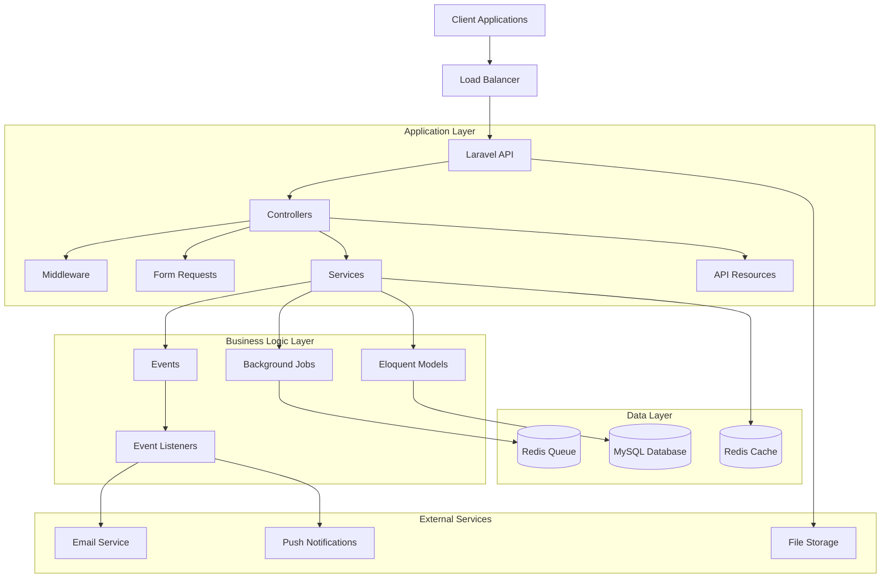

# Laravel API Kit Architecture Documentation

## Overview

Laravel API Kit follows a clean, layered architecture that separates concerns and promotes maintainability, testability, and scalability. This document outlines the architectural decisions and patterns used throughout the application.

## Architecture Diagram



## Architectural Principles

### 1. Separation of Concerns
- **Controllers**: Handle HTTP requests and responses only
- **Services**: Contain business logic and orchestrate operations
- **Models**: Represent data and relationships
- **Policies**: Handle authorization logic
- **Resources**: Transform data for API responses

### 2. Single Responsibility Principle
Each class and method has a single, well-defined responsibility:
- Controllers delegate to services
- Services handle specific business operations
- Models focus on data representation
- Events represent domain events

### 3. Dependency Injection
All dependencies are injected through constructor or method injection:
- Promotes testability
- Enables easy mocking
- Supports interface-based programming

### 4. Event-Driven Architecture
Domain events trigger side effects:
- User registration → Send welcome email
- Task completion → Notify team members
- Project creation → Log audit trail

## Layer Descriptions

### HTTP Layer (Controllers)

**Responsibilities:**
- Validate incoming requests (via Form Requests)
- Delegate business logic to services
- Transform responses using API Resources
- Handle authentication and authorization

**Example:**
```php
class ProjectController extends Controller
{
    public function __construct(
        private ProjectService $projectService
    ) {}

    public function store(StoreProjectRequest $request): JsonResponse
    {
        $project = $this->projectService->createProject(
            $request->validated(),
            $request->user()
        );

        return response()->json([
            'data' => new ProjectResource($project),
            'message' => 'Project created successfully'
        ], 201);
    }
}
```

### Service Layer

**Responsibilities:**
- Implement business logic
- Coordinate between models
- Dispatch events
- Handle complex operations

**Example:**
```php
class ProjectService
{
    public function createProject(array $data, User $user): Project
    {
        $project = Project::create([
            'name' => $data['name'],
            'description' => $data['description'],
            'user_id' => $user->id,
        ]);

        event(new ProjectCreated($project));

        return $project;
    }
}
```

### Data Layer (Models)

**Responsibilities:**
- Define relationships
- Handle data validation
- Implement scopes and accessors
- Define database interactions

**Example:**
```php
class Project extends Model
{
    use HasFactory, SoftDeletes, HasAuditLogs;

    protected $fillable = ['name', 'description', 'user_id'];

    public function user(): BelongsTo
    {
        return $this->belongsTo(User::class);
    }

    public function tasks(): HasMany
    {
        return $this->hasMany(Task::class);
    }
}
```

## Design Patterns Used

### 1. Repository Pattern (Optional)
For complex queries and data access abstraction:
```php
interface ProjectRepositoryInterface
{
    public function findWithTasks(int $id): ?Project;
    public function getActiveProjects(): Collection;
}
```

### 2. Observer Pattern (Events & Listeners)
For handling side effects:
```php
class ProjectCreated
{
    public function __construct(public Project $project) {}
}

class SendProjectCreationNotification
{
    public function handle(ProjectCreated $event): void
    {
        // Send notification logic
    }
}
```

### 3. Strategy Pattern (Policies)
For authorization logic:
```php
class ProjectPolicy
{
    public function update(User $user, Project $project): bool
    {
        return $user->id === $project->user_id || $user->isAdmin();
    }
}
```

### 4. Factory Pattern
For object creation and testing:
```php
class ProjectFactory extends Factory
{
    protected $model = Project::class;

    public function definition(): array
    {
        return [
            'name' => $this->faker->words(3, true),
            'description' => $this->faker->paragraph,
            'user_id' => User::factory(),
        ];
    }
}
```

## API Design

### RESTful Conventions
- `GET /api/projects` - List projects
- `POST /api/projects` - Create project
- `GET /api/projects/{id}` - Show project
- `PUT /api/projects/{id}` - Update project
- `DELETE /api/projects/{id}` - Delete project

### Consistent Response Format
```json
{
    "success": true,
    "data": {},
    "message": "Operation successful",
    "meta": {
        "pagination": {
            "current_page": 1,
            "per_page": 15,
            "total": 100
        }
    }
}
```

### Error Handling
```json
{
    "success": false,
    "message": "Validation failed",
    "errors": {
        "name": ["The name field is required."]
    },
    "code": 422
}
```

## Security Architecture

### Authentication Flow
1. User submits credentials to `/api/auth/login`
2. System validates credentials
3. JWT token generated and returned
4. Client includes token in `Authorization: Bearer {token}` header
5. Middleware validates token on each request

### Authorization Layers
1. **Route Middleware**: `auth:sanctum` for authentication
2. **Controller Middleware**: Role-based access control
3. **Policy Gates**: Resource-specific permissions
4. **Model Policies**: Fine-grained authorization

### Input Validation
1. **Form Requests**: Validate and sanitize input
2. **Database Constraints**: Enforce data integrity
3. **Model Validation**: Business rule validation

## Performance Considerations

### Database Optimization
- **Indexing**: Strategic indexes on frequently queried columns
- **Eager Loading**: Prevent N+1 queries with `with()`
- **Query Optimization**: Use database-specific optimizations

### Caching Strategy
- **Model Caching**: Cache frequently accessed models
- **Query Caching**: Cache expensive database queries
- **API Response Caching**: Cache API responses for read-heavy endpoints

### Queue Processing
- **Background Jobs**: Time-consuming tasks processed asynchronously
- **Job Retry Logic**: Handle failures gracefully
- **Queue Monitoring**: Monitor queue health and performance

## Scalability Features

### Horizontal Scaling
- Stateless application design
- Database session storage
- Queue-based processing
- CDN for static assets

### Microservices Preparation
- Clear service boundaries
- Event-driven communication
- API-first design
- Containerized deployment

## Testing Strategy

### Test Pyramid
- **Unit Tests**: Test individual classes and methods
- **Integration Tests**: Test component interactions
- **Feature Tests**: Test complete user workflows
- **API Tests**: Test HTTP endpoints

### Test Organization
```
tests/
├── Feature/           # End-to-end feature tests
│   ├── Auth/         # Authentication tests
│   ├── Project/      # Project CRUD tests
│   └── Task/         # Task management tests
├── Unit/             # Unit tests
│   ├── Models/       # Model tests
│   ├── Services/     # Service tests
│   └── Policies/     # Policy tests
```

## Monitoring and Observability

### Logging Strategy
- **Application Logs**: Business logic events
- **Error Logs**: Exception tracking
- **Audit Logs**: User action tracking
- **Performance Logs**: Slow query identification

### Health Checks
- Database connectivity
- Redis connectivity
- Queue worker status
- External service health

### Metrics Collection
- API response times
- Database query performance
- Queue processing metrics
- User activity metrics

## Deployment Architecture

### Container Strategy
- Multi-stage Docker builds
- Optimized production images
- Health check integration
- Security best practices

### Environment Management
- Environment-specific configurations
- Secret management
- Feature flags
- Configuration caching

This architecture provides a solid foundation for building scalable, maintainable, and testable Laravel applications while following industry best practices.
